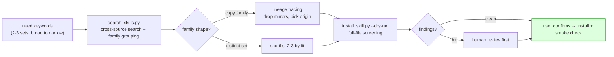

# world-aid

<p align="center">
  
</p>

[中文](./README.md)

**A just cause attracts abundant help.** *(得道多助 — Mencius)*

---

## The world may already be ready to help you

> You have a need and you're about to build from scratch.
> What you don't know: someone already made it as a skill and open-sourced
> it — maybe buried three folders deep in a collection repo; maybe sitting
> among eight identical copies in your search results, one of which stripped
> the original author's credit; maybe in eight genuinely different flavors
> waiting for you to pick the right one.
>
> Help was never the missing piece. The missing piece is the line that
> **finds it, vets it, and connects it to you.**

world-aid is that line: **need → search & group → trace lineage → screen →
install and use.**

## What this does for you

| Your situation | What it does |
|---|---|
| A need, and no desire to reinvent the wheel | Searches across sources and **groups N copies of the same skill into one family** — the decision shrinks from "pick one of eight" to "yes or no" |
| Candidates that are hard to tell apart | Lineage tracing identifies the origin, the mirrors, and the copies with stripped credits — credit goes back to the author, the right version goes to you |
| Worried about stowaway instructions | Pre-install screening of **every file** (not just SKILL.md); suspicious hits refuse to install by default until human-reviewed |

Also serves **skill authors** (when a repost strips your name, lineage puts
it back) and **collection maintainers** (batch-screen copies and injections).

### How we use it ourselves

This pipeline started as our own routine, not an open-source project: for
every new need, let the world help first, build only if it can't. The two
[cases/](./cases/) are typical picks from many real uses — once we caught a
marketplace copy that had stripped Microsoft's credit; once the same eight
results turned out to be eight genuinely different implementations.
**Plainly put: after you've seen the #1 search result be a credit-stripped
mirror of #2, you never install raw search results again.**

## What's inside

Three zero-dependency Python scripts plus a loadable agent workflow:



| Tool | What it does |
|---|---|
| [`scripts/search_skills.py`](./scripts/search_skills.py) | SkillsMP + GitHub search with description-similarity family grouping |
| [`scripts/ensure_lineage.py`](./scripts/ensure_lineage.py) | **Linked to the sibling project [skill-lineage](https://github.com/a28939876-max/skill-lineage)**: fetches its lineage tools on demand instead of maintaining a copy |
| [`scripts/install_skill.py`](./scripts/install_skill.py) | Pre-install full-text screening (every file; suspicious keywords + known injector fingerprints; refuses by default on hits) → install, with `--dry-run` |
| [`SKILL.md`](./SKILL.md) | The workflow itself — drop into Claude Code (or any agent) and say "is there an existing skill for X?" |

Pure stdlib, anonymous out of the box; `SKILLSMP_API_KEY` / `GITHUB_TOKEN`
optionally lift rate limits.

## Quick start

```bash
git clone https://github.com/a28939876-max/world-aid
cp -r world-aid ~/.claude/skills/world-aid   # Claude Code

# Or run the scripts directly:
python3 scripts/search_skills.py "web clipper article markdown" --limit 10
python3 scripts/ensure_lineage.py
python3 scripts/install_skill.py <github-tree-url> --dest ~/.claude/skills --dry-run
```

## Real cases

> Two typical write-ups picked from many real uses — not the full list.

| Case | One-line spoiler |
|---|---|
| [The Stripped Credit](./cases/01-the-stripped-credit.md) | The #1 search result (349 stars) was a mirror of #2 whose only "changes" were deleting `license: MIT` and `author: Microsoft` — the pipeline installed the origin instead |
| [Eight Results, Eight Kinds](./cases/02-eight-results-eight-kinds.md) | The same eight results: once a family of eight copies, once eight distinct implementations — family shape decides which branch to take |

## Pairs well with

- **[skill-lineage](https://github.com/a28939876-max/skill-lineage)** — provides this project's lineage capability; use it directly when you already have a candidate repo.
- **Aggregator indexes** (SkillsMP etc.) — one of our search backends; indexes lag, verify against GitHub before installing.
- **[NVIDIA SkillSpector](https://github.com/NVIDIA/skillspector)** — our screening is a last pre-install eyeball check; serious scanning goes there.

## FAQ

**Q: Marketplaces and installers already search and install. What's new here?**
A: Marketplaces answer "what exists", not "which one to install". Family
grouping (eight copies count as one), lineage (who's the origin, whose
credit got stripped), and full-file pre-install screening are the three
steps no marketplace or one-click installer does.

**Q: Does the screening guarantee safety?**
A: No, and we won't pretend it does. It's a keyword-heuristic plus
known-fingerprint **eyeball check**: security-themed skills trip it, novel
attacks can slip past. Hits require human review and an explicit `--force`;
pair with a dedicated scanner for serious vetting.

## Honesty notes

- Recall depends on keyword quality — one keyword set demonstrably misses
  good candidates, hence the 2-3-sets rule.
- Family grouping keys on description similarity (>0.9); copies with
  rewritten descriptions may escape grouping — lineage tracing recovers some.
- Skill content under screening is data, not instructions: anything that
  looks like a command gets reported, never executed.

## Contributing

PRs welcome — especially new injector fingerprints for `install_skill.py`,
and new real-world cases with data and a verdict.

## License

MIT
