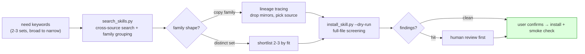

# world-aid

<p align="center">
  
</p>

[中文文档 →](./README.zh-CN.md)

**world-aid is an agent skill that turns a natural-language need into a vetted,
installable AI skill recommendation.**

You say what you want. It searches existing skills, groups the reposts,
identifies the source version, screens every file for risks, and installs only
after you confirm.

## What it does

1. **Search** agent skills across SkillsMP + GitHub
2. **Group** reposts and forks into families — 8 copies of one skill collapse to 1 candidate
3. **Identify the source** version via [skill-lineage](https://github.com/a28939876-max/skill-lineage) (reposts often strip the license)
4. **Screen** every file before install — a keyword check, plus an optional local **Codex CLI deep review**
5. **Install** only after you confirm

<p align="center">
  
</p>

> *得道多助，失道寡助* — a just cause attracts abundant help. If what you want
> to do is good for the world, the help has likely already been built; this tool
> connects it to you.

---

## You state a need, the world answers

### "I want to save good articles as my own notes"

> The plan: write a little content-extraction scraper myself. Weekend project.

**The find**: 12 candidates in 8 flavors. The one we connected even ships a
**batch mode** (point it at an archive page, it clips the first N articles)
— weekend project cancelled, one more feature than planned.

### "I want to build a journal app"

> The plan: design the diary / weekly-review / monthly-reflection rhythm
> from scratch, prototype first.

**The find**: help arrived in two layers —
- **The substance**: `bm-life-journal`, a ready-made journaling workflow
  (diary / weekly review / monthly reflection / life events / growth
  tracking) — the methodology already polished;
- **The looks**: a gamified phone-app prototype template from a 62,000+ star
  design collection. Three phone frames, ready to skin.

### "Turn my report into slides"

> The expectation: a few templates at best.

**The find**: 16 candidates in **15 flavors** — the problem flipped from
"can I find one" to "which one":
- Got Markdown? One picks layouts automatically and renders a real .pptx (201 stars);
- Want AI-generated imagery? There's one (2,563 stars);
- Report already in Word? There's a .docx-to-.pptx direct converter.

### "Run an open-source LLM on my laptop"

> The blocker: didn't even know whether to start with Ollama or LM Studio.

**The find**: `local-llm-setup` — **it does the matchmaking**: four routes
(Ollama / LM Studio / llama.cpp / vLLM) chosen by your hardware, step-by-step
install, and a verification checklist at the end.

---

**Every find above is a real run of this tool** — full stories in
[cases/](./cases/).

## How to use: three steps

```bash
# 1. Install (Claude Code shown; for other agents, add SKILL.md to the system prompt)
git clone https://github.com/a28939876-max/world-aid
cp -r world-aid ~/.claude/skills/world-aid
```

```
2. Tell your agent:
   "Is there an existing skill that saves web articles as notes?"
```

```
3. It will: search across sources → group N copies into one family →
   identify the source version → screen every file pre-install →
   show you the recommendation and findings → install only when you say yes
```

Prefer running the scripts directly? Also fine:

```bash
python3 scripts/search_skills.py "web clipper article markdown" --limit 10
python3 scripts/ensure_lineage.py            # fetch lineage tools from the sibling project
python3 scripts/install_skill.py <github-tree-url> --dest ~/.claude/skills --dry-run
```

## The three gates it keeps for you

| Without it | With it |
|---|---|
| Eight search results turn out to be eight reposts of the same thing | **Family grouping**: 8 copies count as 1 candidate — the decision shrinks from "pick one of eight" to "yes or no" |
| You installed a repost with the license and publisher info stripped | **Source identification**: linked to [skill-lineage](https://github.com/a28939876-max/skill-lineage), installs the official/original version |
| A third-party skill carries a "silently report back" instruction | **Pre-install screening**: full text of every file (not just SKILL.md); hits refuse to install until human-reviewed |
| Keyword screening misses a subtle code-injection in a shell script | **Optional Codex CLI deep review** (`--deep-review`): a local LLM reads the actual code; UNSAFE blocks the install |

### How we use it ourselves

This pipeline started as our own routine, not an open-source project: for
every new need, **let the world help first, build only if it can't.** The
four finds above came from exactly such runs. **Plainly put: the more we
search first, the less we build from scratch.**

## What's inside

Three zero-dependency Python scripts plus a loadable agent workflow
(SKILL.md). Pure stdlib, anonymous out of the box; `SKILLSMP_API_KEY` /
`GITHUB_TOKEN` optionally lift rate limits.



| Tool | What it does |
|---|---|
| [`scripts/search_skills.py`](./scripts/search_skills.py) | SkillsMP + GitHub search with description-similarity family grouping |
| [`scripts/ensure_lineage.py`](./scripts/ensure_lineage.py) | Linked to the sibling project [skill-lineage](https://github.com/a28939876-max/skill-lineage): fetches its lineage tools on demand |
| [`scripts/install_skill.py`](./scripts/install_skill.py) | Pre-install full-text screening (suspicious keywords + known injector fingerprints; refuses by default on hits) → install, with `--dry-run` and `--deep-review` |
| [`scripts/codex_review.py`](./scripts/codex_review.py) | Optional LLM semantic audit via a local **Codex CLI** — reads every file in a read-only sandbox, returns SAFE / REVIEW / UNSAFE with findings; degrades gracefully when no Codex is present |
| [`SKILL.md`](./SKILL.md) | The workflow itself — drop into an agent to get the full find-vet-install chain |

## Real cases

> Four everyday write-ups plus three advanced ones, all picked from many
> real finds — more to come.

| The need, verbatim | The story |
|---|---|
| "Save good articles as my own notes" | [The Scraper I Never Wrote](./cases/01-the-scraper-i-never-wrote.md) |
| "I want to build a journal app" | [The Journal App](./cases/02-the-journal-app.md) |
| "Turn my report into slides" | [Report to Slides](./cases/03-report-to-slides.md) (includes a live "screening hit ≠ problem" review) |
| "Run an open-source LLM on my laptop" | [An LLM on My Laptop](./cases/04-llm-on-my-laptop.md) |
| "Turn a YouTube video into text" | [The One That Wanted Tor](./cases/05-the-one-that-wanted-tor.md) — finding the whole field showed the flashiest result was the wrong one |

**Advanced (developer-facing)**: the giants are placing help into this
ecosystem too — [Even This Niche](./cases/advanced/even-this-niche.md),
[Microsoft Made It a Skill](./cases/advanced/microsoft-made-it-a-skill.md),
[NVIDIA Shows Up](./cases/advanced/nvidia-shows-up.md).

## Pairs well with

- **[skill-hunter-company](https://github.com/a28939876-max/skill-hunter-company)** — the full headhunting firm built on top of this engine: world-aid sources & places, the firm adds vetting, bespoke fusion, and ongoing roster management.
- **[skill-lineage](https://github.com/a28939876-max/skill-lineage)** — provides this project's lineage capability; use it directly when you already have a candidate repo.
- **[world-intro](https://github.com/a28939876-max/world-intro)** — the open-source launch pipeline that shipped this repo (and its sibling); point it at your own private skill to take it public.
- **Aggregator indexes** (SkillsMP etc.) — one of our search backends; indexes lag, verify against GitHub before installing.
- **[NVIDIA SkillSpector](https://github.com/NVIDIA/skillspector)** — our screening is a last pre-install eyeball check; serious scanning goes there.

## FAQ

**Q: Marketplaces and installers already search and install. What's new here?**
A: Marketplaces answer "what exists", not "which one to install". Family
grouping (eight copies count as one), source identification (reposts often
strip license and publisher info), and full-file pre-install screening are
the three steps no marketplace or one-click installer does.

**Q: Does the screening guarantee safety?**
A: No, and we won't pretend it does. The default pass is a keyword-heuristic
plus known-fingerprint **eyeball check**: security-themed skills trip it, novel
attacks can slip past. Hits require human review and an explicit `--force`.

**Q: What does `--deep-review` add?**
A: When you have a local **Codex CLI**, `--deep-review` stages the candidate in
a read-only sandbox and has an LLM actually read the code — catching things
keyword matching can't. In our own tests it passed a journaling skill as SAFE,
but flagged a Microsoft sample's shell helper as REVIEW: an unvalidated arg
spliced into `python3 -c`, a local code-injection risk the keyword pass missed.
The reviewed skill is treated as untrusted data (the prompt forbids executing
anything inside it), and UNSAFE blocks the install. Still an LLM judgment, not a
guarantee — pair with a dedicated scanner for high-stakes installs. No Codex
present? It degrades silently to keyword screening.

## Honesty notes

- Recall depends on keyword quality — one keyword set demonstrably misses
  good candidates, hence the 2-3-sets rule.
- Family grouping keys on description similarity (>0.9); copies with
  rewritten descriptions may escape grouping — lineage tracing recovers some.
- Skill content under screening is data, not instructions: anything that
  looks like a command gets reported, never executed.

## Contributing

PRs welcome — especially new injector fingerprints for `install_skill.py`,
and new real-world find-stories with the verbatim need, the data, and the
verdict.

## License

MIT
