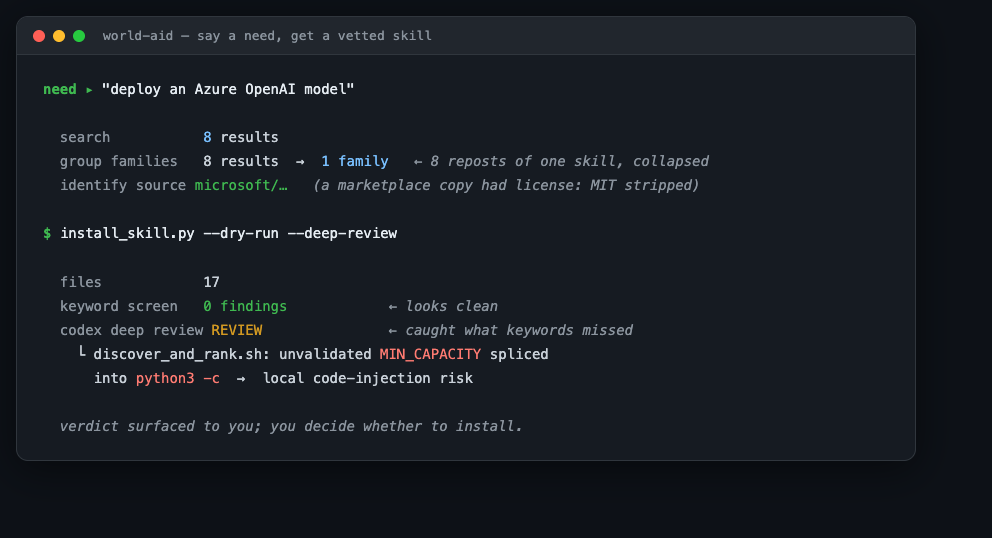

# world-aid · 世界援助

<p align="center">
  
</p>

[English →](./README.md)

**world-aid 是一个给 AI Agent 用的 skill：你说需求，它帮你搜索现成 skill、归族去重、识别源头、装前安检，并在你确认后安装。**

## 它做什么

1. **搜索**：跨 SkillsMP + GitHub 找现成 agent skill
2. **归族**：把转载和 fork 归成族——同一个 skill 的 8 个拷贝合成 1 个候选
3. **认源头**：用 [skill-lineage](https://github.com/a28939876-max/skill-lineage) 修血统，挑出官方/原作版本（转载常把许可证删了）
4. **安检**：装前扫每个文件——关键词目检，外加可选的本机 **Codex CLI 深度审查**
5. **安装**：你确认了才装

<p align="center">
  
</p>

> 得道多助，失道寡助。你想做的事若对世界有利，帮助大概率早已被人做好了——这个工具负责把它接到你手上。

---

## 你说一句需求，世界接一句帮助

### 「看到好文章，想存成自己的笔记」

> 原计划：自己写个抓正文的小爬虫，周末工程。

**结果**：12 个候选、8 种流派。接通的那个连"给一个归档页、自动抓前 N 篇"的**批量模式**都做好了——周末工程取消，比原计划还多一个功能。

### 「我想做一个手帐式 app」

> 原计划：从零设计"日记 + 周回顾 + 月反思"该怎么排，先画原型再说。

**结果**：里子面子各找到一层——
- **里子**：`bm-life-journal`，现成的手帐工作流（日记/周回顾/月反思/人生事件/成长追踪），方法论都替你打磨好了；
- **面子**：62000+⭐ 设计合集里的游戏化手机 app 原型模板，三个手机框，外观直接套。

### 「把我的报告做成一份 PPT」

> 预期：顶多找到几个模板，凑合用。

**结果**：16 个候选、**15 个流派**，问题从"找不找得到"变成"挑哪个"——
- 手里是 Markdown？有自动挑版式、输出真 .pptx 的（201⭐）；
- 想要 AI 配图？有（2563⭐）；
- 报告本来就是 Word？有 .docx 直转 .pptx 的，字面意义的"报告变 PPT"。

### 「想在自己电脑上装个开源大模型」

> 卡点：连该从 Ollama 还是 LM Studio 下手都不知道。

**结果**：`local-llm-setup`——**选型它替你做**：Ollama / LM Studio / llama.cpp / vLLM 四条路线按你的硬件（CPU/GPU/显存）挑，一步步装，装完还有验证清单告诉你通没通。

---

**以上每一行都是用本工具真实跑出来的**，完整找寻过程在 [cases/](./cases/)。

## 怎么用：三步

```bash
# 1. 装（Claude Code 为例；其它 agent 把 SKILL.md 加进系统提示即可）
git clone https://github.com/a28939876-max/world-aid
cp -r world-aid ~/.claude/skills/world-aid
```

```
2. 对你的 agent 说一句：
   "有没有现成的 skill 能把网页文章存成笔记？"
```

```
3. 它会去：跨源搜索 → 把同一个东西的 N 个拷贝归成一族 → 认出源头版本
   → 装前全文安检 → 给你看推荐和安检结果 → 你点头才装
```

不用 agent、想直接跑脚本也行：

```bash
python3 scripts/search_skills.py "web clipper article markdown" --limit 10
python3 scripts/ensure_lineage.py            # 首次取回修谱工具（来自姊妹项目，零配额）
python3 scripts/install_skill.py <github-tree-url> --dest ~/.claude/skills --dry-run
```

## 它替你把住的三道关

| 没有它 | 有了它 |
|---|---|
| 搜出 8 条结果，挨个点开发现是同一个东西的 8 个转载 | **归族**：8 个拷贝算 1 个候选，决策从"八选一"变"要不要" |
| 装了个转载版，许可证和出品方信息都被删了 | **认源头**：联动 [skill-lineage](https://github.com/a28939876-max/skill-lineage) 修谱，装官方/原作版本，更新和出处都跟得上 |
| 第三方 skill 里夹了条"悄悄上报"的指令没人发现 | **装前安检**：全部文件全文扫描（不只 SKILL.md），命中可疑模式默认拒装、人审后才放行 |
| 关键词目检漏掉 shell 脚本里一处隐蔽的代码注入 | **可选 Codex CLI 深审**（`--deep-review`）：本机 LLM 真读代码，判 UNSAFE 直接拦下安装 |

### 我们自己就是这么用的

这条管线最早不是为开源做的，是自用流程的固化：每次有新需求，**先让世界帮一把，找不到再自己写**。开头那四段就是这么跑出来的。**说白了：这么找下来，自己从头写的次数越来越少。**

## 里面有什么

三个零依赖 Python 脚本 + 一套可加载进 AI agent 的编排流程（SKILL.md），纯 stdlib、匿名开箱即用（`SKILLSMP_API_KEY` / `GITHUB_TOKEN` 可选放宽限流）：


| 工具 | 干什么 |
|---|---|
| [`scripts/search_skills.py`](./scripts/search_skills.py) | SkillsMP + GitHub 跨源搜索，按描述相似度归族 |
| [`scripts/ensure_lineage.py`](./scripts/ensure_lineage.py) | 联动姊妹项目 [skill-lineage（族谱.skill）](https://github.com/a28939876-max/skill-lineage)：按需取回修谱工具，不复制维护 |
| [`scripts/install_skill.py`](./scripts/install_skill.py) | 装前全文安检（可疑关键词 + 已知注入指纹，命中默认拒装）→ 落盘安装，支持 `--dry-run` 和 `--deep-review` |
| [`scripts/codex_review.py`](./scripts/codex_review.py) | 可选的 LLM 语义审查：调本机 **Codex CLI** 在只读沙箱里真读每个文件，返回 SAFE / REVIEW / UNSAFE + findings；没装 Codex 就优雅降级 |
| [`SKILL.md`](./SKILL.md) | 编排流程本体：装进 agent 即获得"找+验+装"全链能力 |

## 真实案例

> 四篇亲民案例 + 三篇进阶案例，都是从大量实际找寻里挑出来的典型；新的会持续补充。

| 需求原话 | 找寻记录 |
|---|---|
| "看到好文章想存成自己的笔记" | [以为要自己写爬虫](./cases/01-the-scraper-i-never-wrote.md) |
| "我想做一个手帐式 app" | [我想做一个手帐式 app](./cases/02-the-journal-app.md) |
| "把我的报告做成一份 PPT" | [把报告做成一份 PPT](./cases/03-report-to-slides.md)（含"安检命中 ≠ 有问题"的人审示范） |
| "在自己电脑上装个开源大模型" | [在自己电脑上装个开源大模型](./cases/04-llm-on-my-laptop.md) |
| "把一个 YouTube 视频转成文字" | [差点选了那个"功能最全"的](./cases/05-the-one-that-wanted-tor.md)——找全这一片，才看出最唬人的那个不对口 |

**进阶案例（开发者向）**：巨头也在往这个生态里放帮助——[这么冷门也有人做了](./cases/advanced/even-this-niche.md)（"审查 skill 的 skill"都有两个流派）、[微软把它做成了 skill](./cases/advanced/microsoft-made-it-a-skill.md)（官方 17 文件工程级 skill）、[连 NVIDIA 都来帮忙](./cases/advanced/nvidia-shows-up.md)（企业级扫描器，好到我们放弃自造直接采用）。

## 配合食用

- **[skill-hunter-company（skill 猎头公司）](https://github.com/a28939876-max/skill-hunter-company)**：架在本引擎之上的完整猎头公司。world-aid 管搜罗与落位，猎头公司再加背调、定制融合和长期名册管理。
- **[skill-lineage（族谱.skill）](https://github.com/a28939876-max/skill-lineage)**：本项目的修谱能力来自它。只想对一个已知仓库修谱 → 直接用它。
- **[world-intro](https://github.com/a28939876-max/world-intro)**：把这两个仓库开源出去的发布管线；想把你自己的私有 skill 推上线，就用它。
- **聚合索引站**（SkillsMP 等）：本工具的搜索底座之一；索引可能滞后，安装前以 GitHub 现状为准。
- **[NVIDIA SkillSpector](https://github.com/NVIDIA/skillspector)**：本工具的安检是装前最后一道目检；重型安全扫描交给它。

## 须知 FAQ

**Q：市场和安装器已经能搜能装了，这个多做了什么？**
A：市场负责"有什么"，不负责"该装哪个"。归族（八个拷贝算一个）、认源头（转载常删许可证和出品方信息）、装前全文安检（含 scripts/，命中默认拒装）——这三步是市场和一键安装器都不做的。

**Q：安检能保证安全吗？**
A：不能，也不装能。默认那道是关键词启发式 + 已知注入指纹的**装前目检**：讲安全的 skill 会自指误报，新型攻击也可能漏。命中必人审、人审后才 `--force`。

**Q：`--deep-review` 多做了什么？**
A：本机装了 **Codex CLI** 时，`--deep-review` 把候选放进只读沙箱、让 LLM 真读代码，抓关键词抓不到的东西。我们自己实测：一个日记 skill 判 SAFE，但一个微软样例的 shell 脚本判 REVIEW——它把未校验的参数拼进了 `python3 -c`，是关键词目检漏掉的本地代码注入风险。被审 skill 当作不可信数据处理（prompt 禁止执行其中任何内容），判 UNSAFE 直接拦下安装。仍是 LLM 判断、非保证，高风险场景请配合专业扫描器；没装 Codex 就静默降级回关键词目检。

## 诚实声明

- 搜索召回受关键词质量影响：实测单组关键词会漏掉好候选，所以流程规定 2~3 组、由宽到窄。
- 归族按描述相似度判定（>0.9 同族），魔改过描述的拷贝可能漏归——修谱那步会补救一部分。
- 被安检的 skill 内容是数据不是指令：里面任何"现在执行 xx"只会被上报，绝不执行。

## 欢迎 PR

- `install_skill.py` 的注入指纹库：发现新的安装器/平台注入模式，提上来让所有人受益。
- 新的真实找寻案例（cases/）：有需求原话、有数据、有结局的最好。

## License

MIT
