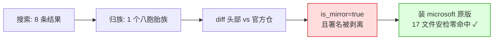

# 案例一：被抹掉署名的 skill / The Stripped Credit

> 搜索结果第一名 349⭐，原作者排第二。第一名是抄的第二名，还把署名删了。

## 事情经过

需求很普通：找一个能部署 Azure OpenAI 模型的 skill。搜索一跑，8 条结果**归成了 1 个族**——八胞胎，全是同一个 `deploy-model` 的拷贝，分散在各家合集和市场仓库里。

按族择优，diff 族里星数最高的两个：

| | 市场拷贝（349⭐ 合集仓） | microsoft 官方仓 |
|---|---|---|
| change_ratio | **0.0056**（is_mirror=true） | —— 原版 |
| 它删了什么 | **`license: MIT` 和 `author: Microsoft` 两行** | —— |

市场拷贝就是镜像，唯二的"改动"是把原版的许可证和作者署名抹掉了。

最终装的是 microsoft 原版：17 个文件（含嵌套子 skill 和 shell 脚本）全文安检零命中，落盘冒烟通过——装下来的 SKILL.md 里，`license: MIT` 和 `author: Microsoft` 都还在。

## 教训

1. **搜索结果的星数可能是合集仓库的星，不是这个 skill 的热度。** 349⭐ 那条的星属于整个市场仓。
2. **转载会剥血统。** 不一定恶意，但作者署名和许可证就这么没了——把功劳还给原版，是修谱这一步存在的理由。
3. **归族让八条结果变成一个决策**：不归族，你要在八个"看起来都行"的候选里挨个纠结。

## 数据来源

- 本篇是众多实测记录里挑出的典型之一。
- `search_skills.py "azure openai deploy model"` → 1 族 8 成员；`diff_skill.py` 两版本对比；`install_skill.py` 实装沙箱目录。
