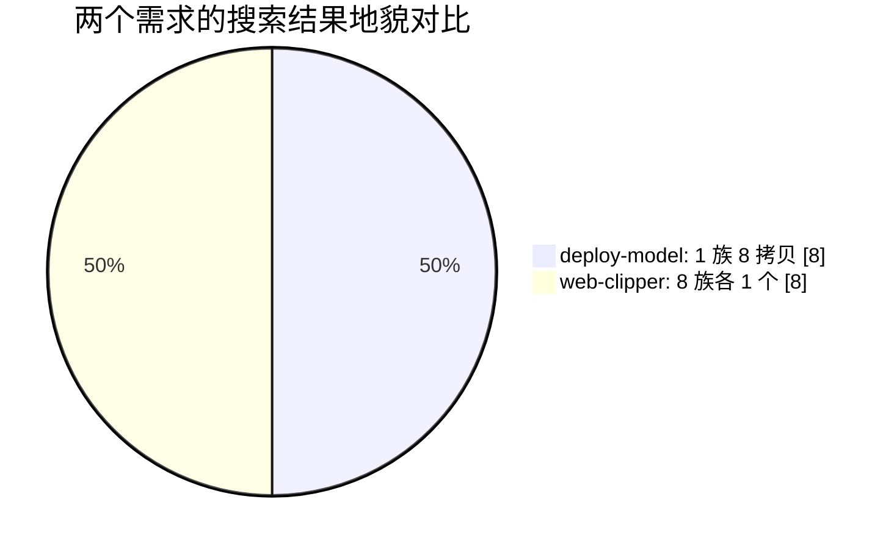

# 案例二：八条结果八个样 / Eight Results, Eight Kinds

> 上一个需求搜出八胞胎，这一个搜出八兄弟——管线得认得出这是两种地貌。

## 事情经过

需求：把网页文章剪藏成 Markdown。搜索同样返回 8 条，但这次**归族结果是 8 个族、每族 1 个成员**——没有拷贝群，八个各自独立的实现：有存 Obsidian 的、有进微信收藏的、有带语义搜索做"稍后读"库的。

两种地貌，两条分支：

- **拷贝族地貌**（案例一）：先族内淘汰镜像，再 diff 选版本——决策在"哪个拷贝"。
- **独立群地貌**（本篇）：跳过族内淘汰，直接按"描述对不对口"挑 2~3 个进修谱和安检——决策在"哪种实现"。

挑了其中一个候选 dry-run：16 个文件（含 Python 脚本和测试）安检零命中，随时可装。

## 教训

1. **归族的价值不只是去重，还是地貌识别**：族的形状直接告诉你下一步该走哪条分支。
2. **单组关键词召回不够。** 事后比对一份更早的人工检索记录：两组关键词（"web clipper" + "url to markdown"）比单组多捞出近一半候选，包括当时的头号推荐。所以管线规定：**2~3 组英文关键词，由宽到窄**。
3. **repo 级同名搜索会捞进同名的非 skill 项目**（比如 6800⭐ 的同名浏览器插件）——先按"有没有 SKILL.md"甄别，再谈比较。

## 数据来源

- 本篇是众多实测记录里挑出的典型之一。
- `search_skills.py "web clipper article markdown"` → 8 族 × 1；`install_skill.py --dry-run` 候选目录 16 文件零命中。
